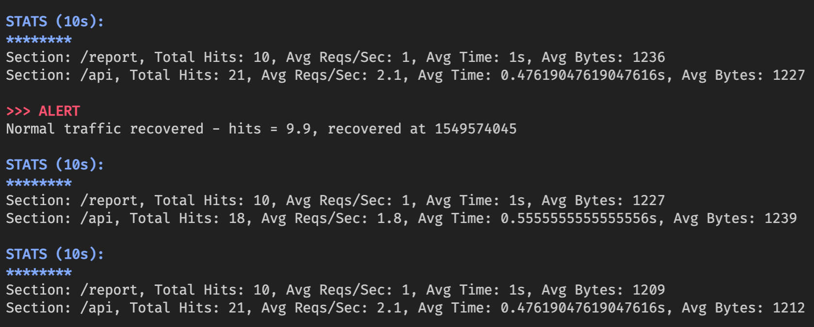
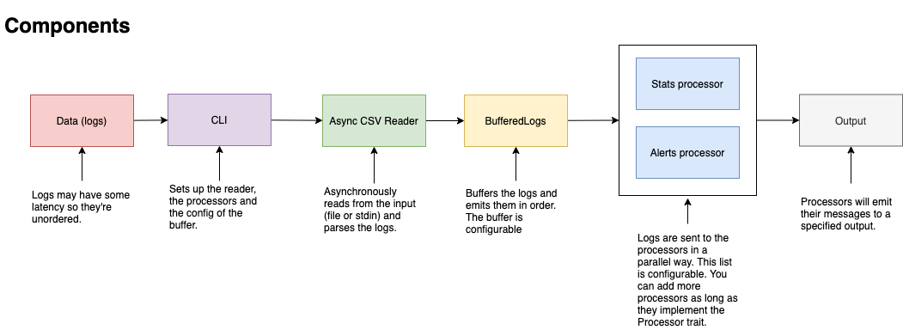

# Log Ingestor

A simple tool to ingest http logs.

## Motivation

This is merely an exercise to play a little bit with Rust so take it with a pinch of salt. There are many things that can be improved.

## Features

The tool can ingest logs both from a file or from the standard input.

The logs are CSV formatted:

```csv
"remotehost","rfc931","authuser","date","request","status","bytes"
"10.0.0.2","-","apache",1549573860,"GET /api/user HTTP/1.0",200,1234
"10.0.0.4","-","apache",1549573860,"GET /api/user HTTP/1.0",200,1234
```

There's a sample [here](sample.csv).

## Usage

The project is written in [Rust](https://www.rust-lang.org/), so for you to run it you need to install it. Follow [these instructions](https://www.rust-lang.org/tools/install) to install it.

In order to run it you can use the following command:

```sh
# get the logs from a file
cargo run --release sample.csv
# or use the standard input
cargo run --release < sample.csv
```

On the other hand, you can also build the tool and then run it from the command line using the following command:

```sh
# let's build it
cargo build --release
# and then run it
./target/release/log-ingestor sample.csv
# or
./target/release/log-ingestor < sample.csv
```

You should get a list of events similar to this one:



## Events

The tool produces a list of events depending on the logs it receives:

- **Stats**: Every 10 seconds it prints some statistics about the requests received separated by section. A section is the first part of the request path (e.g. `/api/user`, the section is `/api`).

- **Alerts**: In case there are more than 10 requests per second as average during a period of 2 minutes, it will print an alert with information about the the avg request per second and the time when the alert was triggered. It will also display another alert message whenever the high traffic alert is recovered. 

## Architecture

Here's a simple diagram about the architecture of the tool which describes what are the main components and how they interact together.



One of the basic ideas is that all the components are independent so they can be easily tested. There's no coupling to the reader, the writer or  even the processors. By leveraging [traits](https://doc.rust-lang.org/reference/items/traits.html), we can feel free to change the implementation of some of the components.

It's also important to mention that **the code is asynchronously executed** when reading, parsing and buffering the logs. Processes are spawned in different threads (see [Writer](#writer) for more details).

## Testing

Most of the components have been tested so we can be sure that the tool works as expected. Nevertheless, the CLI has not been exhaustively tested. Mostly because of time constraints while developing the exercise and because the rest of components are quite covered.

You can run the tests by executing the following command:

```sh
cargo test
```

## Tracing & environment variables

I normally use to instrument the code I write so I can understand what's going on. The tool has been instrumented using the [tracing](https://docs.rs/tracing/0.1.31/tracing/) crate.

In order to enable it, you can set the env var `RUST_LOG` to `log-ingestor=debug`.

Alternatively, you can leverage the [dotenv](https://docs.rs/dotenv/latest/dotenv/) support to set the env var `RUST_LOG` in the `.env` file.

## Future improvements and limitations

Because of time constraints I did only implement the basic features of the tool.

I'm going to describe here some of the limitations and possible ways to improve it.

### Writer

The writer is synchronous so it will block the threads. It's not a problem for the moment because the tool is really performant but this could pose a problem with large datasets.

Ideally, it would be nice to be able to use an [async writer implementation](https://docs.rs/tokio/1.17.0/tokio/io/trait.AsyncWrite.html) the same we're using an async reader.

The limitation is not technical. It's just I didn't have time to implement it.

For the time being, I went with [rayon](https://docs.rs/rayon/latest/rayon/) in order to leverage the parallelism of the machine when processing the logs.

### BufferedLogs

This component is configurable and we can set up the amount of seconds to buffer. On top of that, it will group the logs by time and return them in order.

One thing that is missing is the ability to handle the logs that were not correctly parsed. Now, it will just swallow the error and trace it. We should probably think of a better strategy to deal with this in the long term.

### Stats processor

One of the problems while working on this project is that we're not ingesting the logs in real time, meaning that they are ingested from a file or the standard input fairly quickly.

This means that we cannot use time to unblock or trigger certain events and that's why I chose to naively implement the stats processor.

The idea is that we should be able to get stats every 10 seconds, but check this case:

Let's imagine we have a first log in time 0 and a second log in time 20.

Ideally, we should get a stats event for first log in time 10 and a stats event for second log in time 20.

If we could rely on time, we could just trigger the event once 10 seconds have passed since the first log. Unfortunately, we can't do that.

The current implementation will just trigger the event once the second log is received (given that goes far beyond the 10 seconds) or the stream ends.

This works, but it means that you can find stats events that are triggered beyond the 10 seconds interval that we stablished.

We should work on that algorithm to improve the stats processor in this regard. A possible approach would be to calculate the amount of time that has (virtually) passed when receiving the second log and create the events accordingly. For example, in our case, when receiving the log in time 20, we can know that 2 events should be triggered and we could process the logs and split them into two events.

Aside from that, the stats processor doesn't ensure that the stats shown are ordered. Just to be clear, **the stats events will be shown in order** but the statistics of the logs are not. For instance, when receiving a stat event, we will see the amount of hits that each section is receiving. It should be possible that you would see the amount of hits for section `/api` first (with 5 hits) and then the amount of hits for section `/api/user` (with 100 hits). This is just a nice to have as doesn't affect the correctness of the stats.
